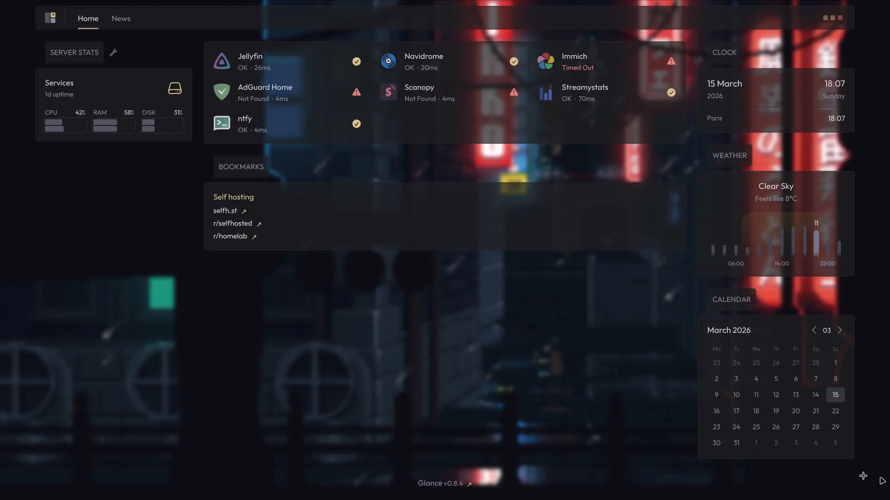

# Serveur domestique

## Déploiement d'un serveur pour héberger des applications

Projet personnel

<article class="retex-wrapper">

<article class="screenshots">

<section class="screenshot">

Dashboard listant les applications hébergées sur le serveur

</section>

</article>

<article class="content">

<section class="text">

### Cahier des charges

- Stockage volumineux disponible dans le réseau domestique
- Accès à plusieurs applications hébergées en local

**Objectif : gouvernance totale sur mes données** (et aiguiser mes compétences d'administration système)
</section>

<section class="text">

### Outils 

-  Debian 
  - Système d'exploitation hôte
  - A pour avantage d'être stable et fiable, et d'avoir des mises à jour de sécurité
-  Stacks Docker Compose
  - Déclaration et virtualisation des services et applications
-  Traefik
  - Proxy inversé pour accéder aux services via un nom de domaine
-  OpenZFS
  - Gestion du stockage et de la redondance des données
  - Trois disques de 4TB dans une pool en RaidZ1 (un disque sur trois peut être défectueux sans que les données soient détruites)
-  Tailscale
  - Gestion des connexions externes via un VPN

</section>

<section class="text">

### Ce qui reste

- Gestion des connexions extérieures sans utiliser Tailscale (outil propriétaire)
- Apprendre Proxmox pour potentiellement lancer des machines virtuelles
- Gestion des sauvegardes (pour le moment il n'y en a pas mais rien de sensible n'est stocké)
- Documentation détaillée

</section>

<section class="text">

### Compétences Acquises

- Utilisation de ZFS pour le stockage volumineux
- Déploiement de plusieurs stacks Docker sur une même machine
- Les niveaux de RAID et équivalents RaidZ

</section>

</article>

</article>
