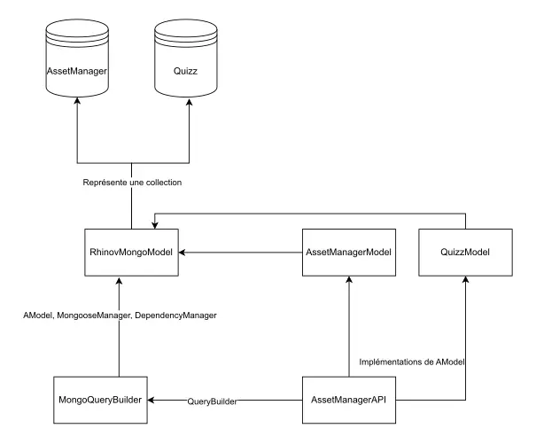

# Bibliothèque de requêtage

## Développement de bibliothèques TypeScript pour interrogation MongoDB

<article class="retex-wrapper">

<article class="screenshots">

<section class="screenshot">

Nouvelle architecture de la plateforme AssetManager

</section>

</article>

<article class="content">

<section class="text">

### Cahier des charges

- AssetManager : plateforme de stockage d'éléments de décoration intérieure utilisée par des services internes
- Refactorisation de code de requêtage de l'API
- Création de bibliothèques d'interrogation et de définition de données ("modèles")
- Intégration de ces bibliothèques dans l'API

</section>

<section class="text">

### Langages et méthodes

- TypeScript, Bun, MongoDB (Mongoose)
- Optimisation des requêtes effectuées, utilisation du mode approprié
- Réflexions sur l'architecture avant et pendant le développement

</section>

<section class="text">

### Livrés et livrables

- Code propre et scalable, quelques gains en performance
- Robustesse accrue

</section>

<section class="text">

### Compétences Acquises

- Approfondissements de MongoDB et TypeScript
- Communication et discussions autour de choix d'architecture
- Comprendre les besoins et enjeux d'une refactorisation majeure

</section>

</article>

</article>
