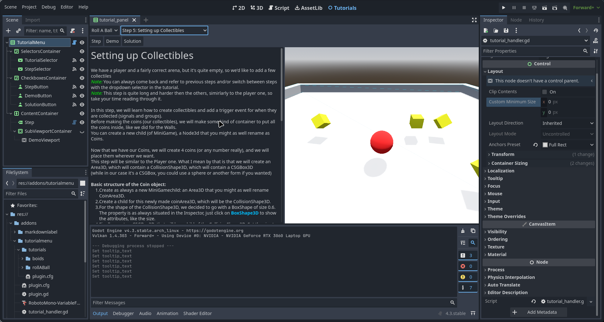

# Plugin Godot

## Développement d'un plugin Godot pour des tutoriels

<article class="retex-wrapper">

<article class="screenshots">

<section class="screenshot">

Affichage d'une étape d'un tutoriel

</section>

</article>

<article class="content">

<section class="text">

### Cahier des charges

- Création d'un plugin Godot qui affiche des tutoriels
- Intégration avec l'éditeur
- Description de l'étape, démonstration et solution

</section>

<section class="text">

### Langages et méthodes

- GDScript
- Création de "nodes" dans l'éditeur pour ensuite placer le contenu
- Plugin [MarkdownLabel](https://godotengine.org/asset-library/asset/2302) pour la rédaction des tutoriels
- Chaque étape dans un dossier différent
- Lecture de fichiers texte

</section>

<section class="text">

### Livrés et livrables

- Plugin fonctionnel
- Ajout d'autant de tutoriels que souhaité
- La démonstration dans l'éditeur n'est pas interactive

</section>

<section class="text">

### Compétences Acquises

- Développement de projets Godot, GDScript
- Création de plugins Godot et intégration avec l'éditeur

</section>

</article>

</article>
