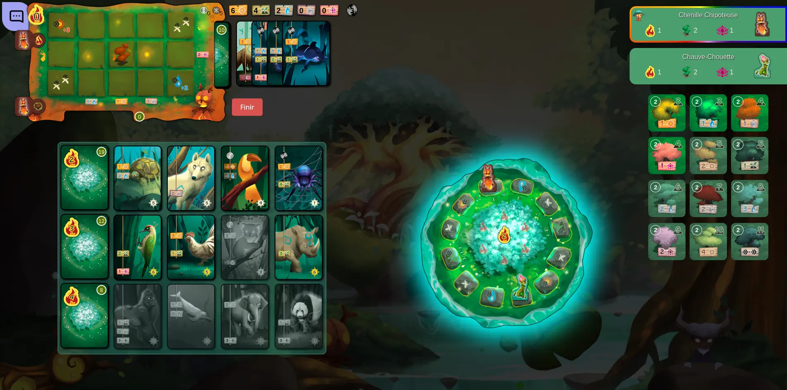

# Application web

## Portage d'un jeu de plateau

<article class="retex-wrapper">

<article class="screenshots">

<section class="screenshot">

Affichage d'un réseau avec un algorithme de simulation de force

</section>

</article>

<article class="content">

<section class="text">

### Cahier des charges

- Portage d'un jeu de plateau existant
- Choix des technologies libre

</section>

<section class="text">

### Langages et méthodes

- React, Typescript, Node.js
- Transposition des fonctionnalités du jeu en issues GitLab

</section>

<section class="text">

### Livrés et livrables

- Règles du jeu implémentées
- Animations
- Aspect multijoueur pas implémenté

</section>

<section class="text">

### Compétences Acquises

- Développement pour un projet innovant
- Approfondissement de React et Typescript

</section>

</article>

</article>
